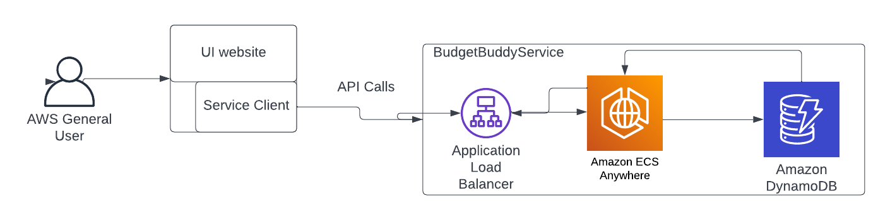

# Budget Buddy API Documentation

## Background
People all over the world come in contact with money every day yet most don't understand
manage it. Understandably managing and keeping track of all your money can be stress full and
tiring.

This design document describes the Budget Buddy API, a service providing the ability to keep and
manage all a persons finances.

## Glossary

**User** - A person that has a unique access code to a personalized budget plan.

**Ledger** - Entire set of personal finances.

**Income** - Keeps track of all income streams

**Expense** - Keeps track of all expenses.

## Business Requirements
* As a user, I want to retrieve my ledger.
* As a user, I want to retrieve my calendar.
* As a user, I want to retrieve my income.
* As a user, I want to retrieve my expenses.
* As a user, I want to add, remove, or edit my expenses, income, and calendar for my ledger

## Architecture


Figure 1: Diagram showing the architecture of the Budget Buddy API. A user connects to the 
clients' website. the Client makes a API call to the Budget Buddy API with AWS load balancer.
This Forwards the request to ECS, which connects to a persistent data store for Ledger,
income, and expense responses then flow back to the client.

## Budget Buddy Service API Implementation Notes

### `CreateLedger`
* Creates a new empty ledger for a given first and last name.
* returns a new ledger.
* Throws a `ValidationException` when the given user id is an empty string

```
CreateLedgerRequest {
    "firstName": "jhon",
    "lastName: "kane"
}    
```

```
CreateLedgerResponse {
 "Ledger: {
    "ledgerId":  autoGenerated userID,
    "firstName": "jhon",
    "lastName": "kane",
    "incomes": empty optional,
    "expenses": empty optional,
    "totalBalanceBeforeExpense": empty optional of type float,
    "totalBalanceBeforeExpense": empty optional of type float
    }
}
```

### `GetLedger`
* Retrieves the clients entire financials from User given a ledgerId.
* Returns a list of Incomes and Expenses.
* Returns a list only if the given ledgerId is valid.
* Throws a `ValidationException` when the given user id is an empty string.
* Throws a `LedgerNotFoundException` when there is no ledger matching user id.

```
GetLedgerRequest {
    "ledgerId": "hjd2-3fds-2cdsf"
    }
```

```
GetLedgerResponse {
   "ledgerId": "hjd2-3fds-2cdsf"
   "incomes": {
            "M": {
              "gfdh-fd34-f73g7f2": {
                "income": {
                  "amount": {"N": "1000"},
                  "incomeSource": {"S": "Salary"},
                  "dueDate": {"S": "2022-04-01"},
                  "note": {"S": "Monthly income"}
                }
              },
              "gfdh-u62f-f73g7f2": {
                "income": {
                  "amount": {"N": "500"},
                  "incomeSource": {"S": "Freelance work"},
                  "dueDate": {"S": "2022-04-15"},
                  "note": {"S": "Extra income"}
                }
              }
            }
          },
          "expenses": {
            "M": {
              "f735-fd34-f73g7f2": {
                "expense": {
                  "amount": {"N": "800"},
                  "expenseName": {"S": "Rent"},
                  "dueDate": {"S": "2022-04-05"},
                  "note": {"S": "Monthly rent payment"},
                  "paid": {"BOOL": true}
                }
              },
              "g48f-fd34-f73g7f2": {
                "expense": {
                  "amount": {"N": "50"},
                  "expenseName": {"S": "Internet"},
                  "dueDate": {"S": "2022-04-10"},
                  "note": {"S": "Monthly internet bill"},
                  "paid": {"BOOL": false}
                }
              }
            }
          },
          "firstName": {"S":  "dave"},
          "lastName": {"S":  "mathews"},
          "totalBalanceBeforeExpense": {"N": "1500"},
          "totalBalanceAfterExpense": {"N": "700"}
}
```

### `DeleteLedger`
* Deletes the ledger associated with the given ledgerId.
* Returns a empty response object.
* Throws a `LedgerNotFoundException` when the given user id is not found.
* Throws a `ValidationException` when the given user id is an empty string.

```
DeleteLedgerRequest {
    "ledgerId": "hjd2-3fds-2cdsf"
}
```

```
DeleteLedgerResponse {
    An empty response object for now (can be updated if needed)
}
```

### `UpdateLedger`
* Can remove or modify A firstName, lastName.
* Returns the modified Ledger with the updated first and last name.
* Throws a `ValidationException` when the given ledgerId is an empty string.
* Throws a `LedgerNotFoundException` when no ledger is found matching the given ledgerId.

#### `UpdatedLedger (update first and last name)`

```
UpdateLedgerRequest {
     "ledgerId": "hjd2-3fds-2cdsf",
     "newFirstName": "lolly",
     "newLastName": "amber"
}
```

```
UpdatedLedgerResponse {
    // all other items and objects stay the same.
    "firstName": "lolly",
    "lastName": "amber"
}
```

### `CreateIncome`
* Can create a new income object given a valid ledgerId.
* Returns a new Income object and updates the associated ledger.
* Throws a `ValidationException` when the given ledgerId is an empty string.
* Throws a `LedgerNotFoundException` when no ledger is found matching the given ledgerId.

### `UpdateIncome`
* Can update a specific income object given a valid ledgerId and recordId.
* Returns A updated income object and updates the associated ledger.
* Throws a `ValidationException` when the given ledgerId is an empty string.
* Throws a `IncomeNotFoundException` when there is no income matching incomeID.
* Throws a `LedgerNotFoundException` when no ledger is found matching the given ledgerId.

### `DeleteIncome`
* Can delete a specific income object given a valid ledgerId and recordId.
* Returns A empty response object and deletes the income object from the ledger.
* Throws a `ValidationException` when the given ledgerId is an empty string.
* Throws a `IncomeNotFoundException` when there is no income matching incomeID.
* Throws a `LedgerNotFoundException` when no ledger is found matching the given ledgerId.

### `DeleteAllIncome`
* Can delete all income objects given a valid ledgerId
* Returns A empty response object and deletes all income objects from the ledger.
* Throws a `ValidationException` when the given ledgerId is an empty string.
* Throws a `LedgerNotFoundException` when no ledger is found matching the given ledgerId.

### `CreateExpense`
* Can create a new expense object given a valid ledgerId.
* Returns a new Expense object and updates the associated ledger.
* Throws a `ValidationException` when the given ledgerId is an empty string.
* Throws a `LedgerNotFoundException` when no ledger is found matching the given ledgerId.

### `UpdateExpense`
* Can update a specific expense object given a valid ledgerId and recordId.
* Returns the updated expense object and updates the associated ledger.
* Throws a `ValidationException` when the given ledgerId is an empty string.
* Throws a `ExpenseNotFoundException` when now expense object is found with the given recordId.
* Throws a `LedgerNotFoundException` when no ledger is found matching the given ledgerId.

### `DeleteExpense` 
* Can delete specific expense objects given a valid ledgerId and recordId.
* Returns an empty response object and updates the associated ledger.
* Throws a `ValidationException` when the given ledgerId is an empty string.
* Throws a `ExpenseNotFoundException` when now expense object is found with the given recordId.
* Throws a `LedgerNotFoundException` when no ledger is found matching the given ledgerId.

## Data Model

Ledgers: Stores data about the users incomes and expenses.

Below are the data models for the DynamoDB table

### Ledger
Note: for both incomes and expenses keys are their recordIds, the recordIds will be there sort keys.
* ledgerId (String, partition key)
* incomes (HashMap, Maps key is sortKey)
* expenses (HashMap, Maps key is sortKey)
* recordIds (Set, sortKey, stores the expenses and incomes ids to be accessible by dynamoDB)
* firstName (String, attribute)
* lastName (String, attribute)
* totalBalanceBeforeExpense (Number attribute)
* totalBalanceAfterExpense (Number attribute)

### Income 
* amount (Number)
* incomeSource (String)
* dueDate (String)
* note (String)
* given (boolean)

### Expense
* expenseName (String)
* amount (Number)
* dueDate (String)
* note (String)
* paid (boolean)

## Class Diagram